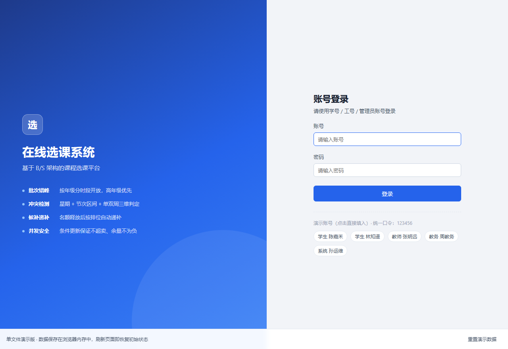
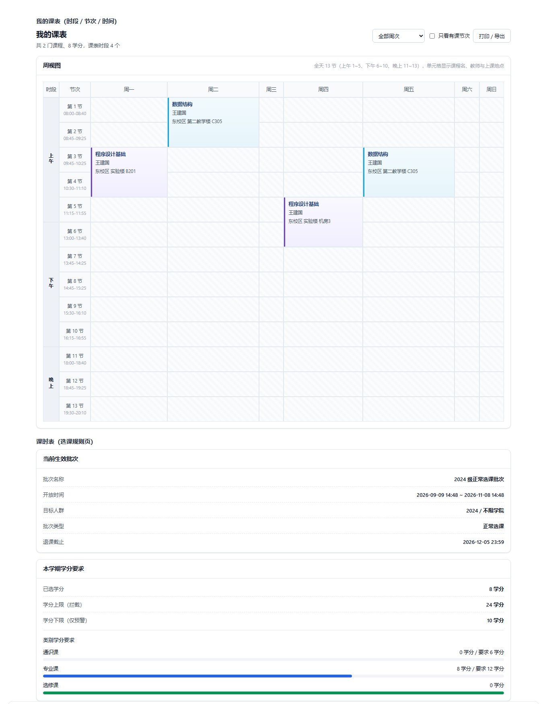

# 在线选课系统（Web 应用与开发 课程作业）

基于 **B/S 三层架构、前后端分离** 的在线选课系统，实现设计文档《选课系统系统设计文档（优化版 V3.0）》中的全部必做功能：
四类角色的权限体系、课程查询、选课 / 退课 / 换课、时间冲突检测、容量与防超卖、候补与自动递补、
学分与类别校验、先修校验、选课批次错峰、通知中心、审计日志与运行监控。

**技术路线**（按作业要求选定）：Java Web（Spring Boot 3 + Spring MVC）+ PostgreSQL + Linux 学生机 +
腾讯云轻量应用服务器 + 域名与 HTTPS 证书 + 源码托管 GitHub。

> 多人并发是本次作业的核心考点，所有"判断 + 自增"都放在数据库里用**条件更新 + 事务**完成，
> 不依赖任何应用层锁，也不依赖 Redis。实测结论见[第 7 章](#7-测试)。

## 0. 在线演示与界面预览

| 入口 | 地址 |
| --- | --- |
| **在线演示**（免安装，点开即用） | <https://tanyunx.github.io/course-selection-system/> |
| 代码仓库 | <https://github.com/Tanyunx/course-selection-system> |

> 在线演示是"阶段一"的单文件 mock 版：业务引擎与数据全部内嵌在页面里，保存在浏览器内存中，刷新即恢复初始状态。
> 这与作业要求中"开始时数据可以先用 mock、保存在本地 JSON"相对应；
> "阶段二"的完整版（Java 后端 + PostgreSQL 持久化 + 多人并发一致性）请按[第 3 章](#3-快速开始)在本地或服务器部署，
> 两者界面与业务规则完全一致。

**登录页**（右侧演示账号可一键填入）



**学生课表（全天 13 节：上午 1~5 / 下午 6~10 / 晚上 11~13）与选课规则页**



## 1. 技术栈

| 层次 | 选型 | 为什么这么选 |
| --- | --- | --- |
| 表现层 | HTML5 + CSS3 + 原生 JavaScript（ES Module，**无构建步骤**） | 课程重点是架构与并发，前端不引入打包器可让评审直接看源码 |
| 控制层 | **Spring Boot 3.3.5 + Spring MVC**（`@RestController`） | Java Web 领域当前的主流落地方式，内嵌 Tomcat，无需外置容器 |
| 业务逻辑层 | Spring `@Service` + `TransactionTemplate` 编程式事务 | 选课流程需要精确控制事务边界（"先占后删""失败整体回滚"） |
| 数据访问层 | **Spring JDBC（JdbcTemplate）** + HikariCP 连接池 | 见下方说明 |
| 数据库 | **PostgreSQL 17**（`timestamp without time zone`、行级锁） | 作业推荐；行锁语义清晰，`ON CONFLICT` / `RETURNING` 让并发写法更短 |
| 鉴权 | 自包含 HMAC-SHA256 令牌（`Authorization: Bearer`）+ 服务端会话表 | 前后端分离、跨域场景下比 Cookie 更简单，也避免 CSRF |
| 口令存储 | BCrypt（`bcryptjs` 生成、Spring 侧 `BCryptPasswordEncoder` 校验） | 数据库只存哈希，源码与种子脚本都不含明文口令 |
| 接口风格 | REST + JSON，统一返回体 `{ code, message, data }` | 与设计文档表 4 / 表 5 完全一致 |
| 构建 | Maven 3.9 + JDK 21（LTS） | Spring Boot 3.x 要求 JDK 17+ |
| 部署 | Nginx 托管前端静态资源 + `/api` 反向代理到 Spring Boot（systemd 常驻） | 前后端真正独立部署，前端可单独换 CDN |
| 运行环境 | Linux（Ubuntu 24.04/26.04 LTS） | 作业要求"学生机用 Linux" |

**为什么用 JdbcTemplate 而不是 MyBatis / JPA**

本项目的难点不在 CRUD，而在几条必须"精确控制 SQL 与事务"的并发语句（例如
`UPDATE t_course_offering SET enrolled = enrolled + 1 WHERE id = ? AND enrolled < capacity`）。
JdbcTemplate 让这些语句**逐字可见、可控**，评审时能直接在代码里看到"依赖数据库行锁防超卖"这件事本身；
同时 SQL 与"阶段一"Node 版保持一致，便于对照阅读。代价是需要手写行到对象的映射，
本书面量工作由 `db/Db.java` 统一封装（见[第 5 章](#5-核心规则实现要点)）。

## 2. 目录结构

```
course-selection-system/
├─ backend/                          # 【后端】Java Web（Spring Boot 3），独立部署单元
│  ├─ pom.xml                        # Maven 依赖与构建（finalName = course-selection-backend）
│  ├─ .env.example                   # 环境变量模板（真实口令只放 .env，已被 .gitignore 排除）
│  ├─ src/main/
│  │  ├─ java/com/campus/course/
│  │  │  ├─ CourseSelectionApplication.java   # 启动类
│  │  │  ├─ common/                  # ApiResponse / Api / ErrorCode / BizException / 全局异常处理
│  │  │  ├─ config/                  # AppProperties（配置绑定）/ JacksonConfig（时间格式）/ WebConfig（CORS + 拦截器）
│  │  │  ├─ db/Db.java               # 数据访问层统一入口：query / update / insertReturningId / withTransaction
│  │  │  ├─ security/                # TokenService（HMAC 令牌）/ SessionStore / AuthInterceptor / @RequireRole
│  │  │  ├─ service/                 # 业务层：选课规则、课程、选课、候补、通知、审计、幂等与限速守卫
│  │  │  ├─ store/                   # 会话、幂等缓存、限速桶、运行指标
│  │  │  ├─ util/Period.java         # 全校统一课时表（13 节）与时段合法性校验
│  │  │  ├─ init/                    # DbInitializer（建表导数据）/ ScheduledTasks（候补超时回收、缓存清理）
│  │  │  └─ web/                     # 9 个 Controller：auth / courses / enrollments / waitlist / notices / teacher / admin / sys / health
│  │  └─ resources/
│  │     ├─ application.yml          # 配置（全部支持环境变量覆盖）
│  │     └─ db/
│  │        ├─ schema-pg.sql         # 【PostgreSQL】建表：18 张表 + 唯一约束 + 索引 + 外键 + updated_at 触发器
│  │        └─ seed-pg.sql           # 种子数据（学期、用户、课程、开课、排课、批次、规则）
│  │
│  └─ src/test/java/com/campus/course/  # 【Java 单元测试】JUnit 5，不启容器、不连库（78 项，见 §7.6）
│     ├─ common/ErrorCodeTest.java   # 6 项：错误码分段、业务码 2001~2014 连续无空洞、未知码回退
│     ├─ db/DbPrepareTest.java       # 16 项：IN (?) 集合展开、空集合、占位符与参数数量校验
│     ├─ db/DbRetryTest.java         # 10 项：40P01 / 40001 可重试，唯一键冲突等不可重试，cause 链自引用不死循环
│     ├─ service/RuleServiceTest.java    # 22 项：热度分档边界、占位符、时间与金额格式化
│     ├─ service/ConflictTextTest.java   # 8 项：冲突提示文案格式
│     ├─ service/ScheduleTextTest.java   # 4 项：星期与单双周文案
│     └─ store/StoreTest.java        # 12 项：限速软/硬阈值、验证码豁免、幂等缓存命中与跨用户隔离
│
├─ frontend/                         # 【前端】原生 HTML + CSS + ES Module，由 Nginx 直接托管
│  ├─ index.html
│  ├─ css/app.css
│  ├─ js/{api,ui,app,scheduleEditor,exportSchedule}.js
│  │                                 #   exportSchedule.js：课表导出（CSV 带 UTF-8 BOM / ICS 符合 RFC 5545）
│  ├─ js/views/{student,teacher,admin,sys}.js   # 四端界面
│  └─ mock/                          # 阶段一：本地 JSON mock 数据层（浏览器内跑通全流程，不依赖后端）
│
├─ tests/                            # 黑盒回归测试（Node 运行，只走 HTTP / 只读校验数据库）
│  ├─ package.json                   # 依赖 pg + bcryptjs（npm install 后即可运行）
│  ├─ smoke.js                       # 接口冒烟测试：19 项
│  ├─ acceptance.js                  # 端到端验收测试：15 项（对应文档表 28 的 TC-01 ~ TC-15）
│  ├─ concurrency.js                 # 并发 / 幂等 / 候补递补实测：17 项
│  └─ stress.js                      # 多人选课高压压测：23 项（四条不变量 × 5 个极端场景，见 §7.5）
│
├─ tools/                            # 开发与运维辅助脚本
│  ├─ pg-setup.sh                    # 本机建库：生成随机口令写 .env → 建角色与库 → 导入 schema
│  ├─ mysql2pg.py                    # MySQL 种子脚本 → PostgreSQL 种子脚本转换器（记录全部迁移规则）
│  ├─ run-backend.sh                 # 本地启动后端（加载 .env、显式下发端口、启动前端口占用预检）
│  ├─ build-backend.sh               # 打包后端（自动定位 java/mvn，走阿里云镜像）
│  ├─ serve-frontend.js              # 本地前端服务器：托管 frontend/ 并把 /api 转发到后端（只依赖 Node 内置模块）
│  ├─ backup-db.sh                   # 数据库备份：pg_dump 自定义格式 + 纯文本 SQL，按份数滚动保留（见 §7.8）
│  ├─ restore-db.sh                  # 数据库恢复：自动识别 .dump / .sql，恢复前默认自动备份，需二次确认
│  ├─ maven-settings.xml             # Maven 国内镜像配置（阿里云 public）
│  └─ build.js                       # 构建单文件演示版（产出 选课系统-单文件版.html 与 docs/index.html）
│
├─ .github/workflows/ci.yml          # 【持续集成】推送到 GitHub 自动跑：Java 单测 + 全链路回归（见 §7.9）
│
├─ legacy/node-backend/              # 【归档】阶段一的 Node.js + Express + MySQL 实现，保留供对照与迁移溯源
│
├─ docs/
│  ├─ index.html                     # 单文件版产物，同时作为 GitHub Pages 站点入口
│  ├─ 课程知识与设计思考.md            # 【报告素材】用到的课程知识、技术选型与踩坑记录
│  ├─ 作业要求对照表.md                # 【报告素材】作业逐条要求的达标情况与缺口清单
│  └─ 现场演示操作卡.md                # 【报告素材】下次课现场生成/演示的操作卡
│
├─ .vscode/                          # VS Code 工作区：tasks.json 一键跑全流程、launch.json 断点调试
│
├─ deploy.sh                         # 云服务器一键部署（Ubuntu + JDK + PostgreSQL + Nginx + HTTPS）
├─ 云服务器部署指南.md                # 部署路线与逐步操作
├─ 交付与验收报告.html                # 交付清单与验收结论
├─ 选课系统-单文件版.html             # 免安装单文件网页，双击即用（无需后端/网络）
├─ 启动选课系统.bat                   # Windows 一键启动本地后端（Java）
│
├─ .uicheck/                         # 开发期前端验证（jsdom），不参与线上运行
│  ├─ static-check.js                # 单文件版界面深度覆盖：四角色全页面 + 菜单权限矩阵 + 弹窗（51 项）
│  ├─ dist-check.js                  # 分发包一致性：两份副本字节一致 + 自包含 + 能离线启动（20 项）
│  ├─ ui-check.js                    # 前后端分离那一路：真实页面 + 真后端 + 真 PostgreSQL（65 项，含课表导出内容级校验）
│  ├─ diag-*.js                      # 课表冲突 / 排课全景等诊断脚本
│  └─ node_modules/                  # jsdom（已被 .gitignore 排除）
│
└─ screenshots/                      # 界面截图
```

## 3. 快速开始

### 3.0 方式一：单文件网页版（免安装，双击即用）

工程根目录的 **`选课系统-单文件版.html`** 是一个完全自包含的网页：

- **无需 JDK、无需 PostgreSQL、无需任何安装**，双击用浏览器打开即可完整演示
- 内嵌了与数据库版同源的全部演示数据（18 张表）与业务规则引擎
  （批次准入、时间冲突、单双节次、单双周、学分上限、先修校验、候补自动递补、幂等、限速均已实现）
- 四类角色登录、选课 / 退课 / 换课 / 候补 / 课表 / 通知 / 教务管理 / 系统监控全部可用
- 数据保存在浏览器内存中，刷新页面即恢复初始状态；页面底部有「重置演示数据」按钮

适合课堂演示、发给同学老师、拷到 U 盘随时打开。若修改了种子数据或业务规则，重新构建：

```bash
node tools/export-data.js    # 可选：从数据库重新导出演示数据
node tools/build.js          # 重新打包单文件（同时产出 docs/index.html）
node tools/test-engine.js    # 引擎回归测试（74 项）
```

### 3.1 方式二：完整版（Java + PostgreSQL）—— 本地开发

#### 环境要求

| 组件 | 版本 | 说明 |
| --- | --- | --- |
| JDK | **21 LTS** | Spring Boot 3.x 要求 17+；本项目按 21 编译 |
| Maven | 3.9+ | 用于构建；国内建议配 `tools/maven-settings.xml` 走阿里云镜像 |
| PostgreSQL | 14+（推荐 17） | 需要能创建数据库与角色 |

#### 第 1 步：准备数据库

**方式 A —— 用脚本一键准备（推荐）**

```bash
bash tools/pg-setup.sh
```

脚本会：生成随机口令写入 `backend/.env`（不回显）→ 创建 `course_app` 角色 → 创建 `course_selection` 库
（并把库与 `public` schema 的属主交给 `course_app`，PostgreSQL 15+ 起 `public` schema 默认归 `pg_database_owner`）→ 导入 `schema-pg.sql`。

**方式 B —— 手工准备**

```bash
sudo -u postgres psql <<'SQL'
CREATE ROLE course_app LOGIN PASSWORD '换成你自己的强口令';
CREATE DATABASE course_selection OWNER course_app ENCODING 'UTF8';
SQL
sudo -u postgres psql -d course_selection -c 'ALTER SCHEMA public OWNER TO course_app;'
```

然后把连接信息写进 `backend/.env`（模板见 `backend/.env.example`）：

```bash
SERVER_ADDRESS=127.0.0.1
SERVER_PORT=3000
DB_HOST=127.0.0.1
DB_PORT=5432
DB_NAME=course_selection
DB_USER=course_app
DB_PASSWORD=你的口令
DB_INIT=false
```

> `backend/.env` 已被 `.gitignore` 排除。源码、脚本、SQL 里**不出现任何口令**，
> 全部通过环境变量注入，符合"口令不入库、不入版本库"的基本要求。

#### 第 2 步：构建并启动后端

```bash
cd backend
mvn -s ../tools/maven-settings.xml -DskipTests clean package   # 产出 target/course-selection-backend.jar

cd ..
bash tools/run-backend.sh --init     # --init = 首次启动时建表并导入演示数据
```

看到下面两行即成功：

```
Tomcat started on port 3000 (http)
数据库初始化完成。生产环境请把 app.db.init-on-startup 改回 false。
```

验证：

```bash
curl http://127.0.0.1:3000/api/health
# {"code":0,"message":"操作成功","data":{"status":"UP","time":"..."}}
```

> **端口为什么不用 `PORT` 变量名？**
> 很多 IDE、云平台与容器运行时会预设 `PORT` / `SERVER__PORT`（Spring 的宽松绑定会把
> `SERVER__PORT` 解析成 `server.port`），在毫无察觉的情况下改掉监听端口。
> 本项目统一用 `SERVER_PORT` / `SERVER_ADDRESS`，并且在 `tools/run-backend.sh` 里
> 以**命令行参数**下发（命令行优先级高于环境变量与配置文件），从根上杜绝被劫持。

#### 第 3 步：启动前端

前端是纯静态资源。本地开发用仓库自带的零依赖脚本，它同时托管 `frontend/` 并把 `/api` 转发到后端，
**因此本地也是同源，不需要配 CORS**：

```bash
node tools/serve-frontend.js            # 前端 http://127.0.0.1:5500，/api → 127.0.0.1:3000
```

然后浏览器访问 <http://127.0.0.1:5500>。

（可选）想用别的静态服务器也可以，但要注意前端用的是同源相对路径 `/api/xxx`，
所以需要用 `?api=` 参数或 `window.__API_BASE__` 指定后端地址：

```bash
cd frontend && python -m http.server 5500
# 访问 http://127.0.0.1:5500/?api=http://127.0.0.1:3000
```

> **不要直接双击 `frontend/index.html`。** 前端要调用后端接口，用 `file://` 打开无法工作。
> 线上部署后前后端由同一个 Nginx 提供，天然同源；`CORS_ORIGINS` 只在调试或前端单独部署时才需要动。

**Windows 一键启动**：双击工程根目录的 `启动选课系统.bat`，脚本会自动检查 jar 是否存在并启动后端
（前端仍需按上面的方式单独启动）。

#### 演示账号

全部演示账号的登录口令统一为：`123456`

| 角色 | 账号 | 姓名 | 说明 |
| --- | --- | --- | --- |
| 学生 | `2024001` | 陈嘉禾 | 2024 级，已选 2 门课，有 1 条候补 |
| 学生 | `2024002` | 林知遥 | 2024 级 |
| 学生 | `2024003` | 吴子墨 | 未通过《程序设计基础》，用于验证先修拦截 |
| 学生 | `2023001` | 黄一诺 | 2023 级，高年级优先批次 |
| 学生 | `2025001` | 郑亦然 | 2025 级，学分上限 20 |
| 教师 | `teacher001` | 张明远 | 维护本人开课的排课与地点 |
| 教师 | `teacher002` | 李佳琪 | |
| 教务管理员 | `academic` | 周教务 | 课程目录、开课计划、批次、学分规则、名额、公告 |
| 系统管理员 | `sysadmin` | 孙运维 | 用户与权限、审计日志、运行监控 |

种子数据共 14 个账号（8 学生 / 4 教师 / 教务 / 系统管理员）。口令在种子脚本里是 `__PWD_HASH__` 占位符，
由 `DbInitializer` 在导入时替换为 BCrypt 哈希，因此**版本库里不存在任何口令（连哈希也没有）**。

## 4. 功能清单

### 学生端
- **选课中心**：按课程名称/代码搜索，按类别、上课星期、校区筛选，支持"仅看可选"与热度/已选人数排序；
  每条开课展示教师、上课时间与地点、学分、类别、`已选/容量`、热度标签、先修要求与实时状态。
- **开课详情**：课程简介、排课时段、先修满足情况、候补队列前 10 位、本学期学分进度、当前生效批次。
- **选课 / 候补 / 退课**：按钮状态严格对应文档表 6（可选 / 已满 / 时间冲突 / 条件不符 / 批次外 / 已选 / 候补中）。
- **换课**：单一事务"先占后放"，目标课程不可选时整体不生效。
- **我的课表**：周视图，支持单双周切换（全周课程在任一视图均显示）、打印导出。
- **我的选课**：学分与类别进度、退课（二次确认）、换课入口。
- **我的候补**：当前排位、前方人数、递补确认。
- **通知中心**：按类型筛选、标记已读、未读角标。
- **选课规则**：展示当前批次、学分与类别要求、全部规则说明与教务公告。

### 节次时间（全校统一《课时表》）

每天 13 节、每节 40 分钟；课表、排课编辑器、冲突检测与课时表展示均以此为准。
常量定义在 `backend/.../util/Period.java`（服务端）与 `frontend/js/ui.js`（前端），两处保持同源。

| 时段 | 大节 | 小节 | 起止时间 |
| --- | --- | --- | --- |
| 上午 | 一 | 1 / 2 | 08:00~08:40 / 08:45~09:25 |
| 上午 | 二 | 3 / 4 / 5 | 09:45~10:25 / 10:30~11:10 / 11:15~11:55 |
| 下午 | 三 | 6 / 7 | 13:00~13:40 / 13:45~14:25 |
| 下午 | 四 | 8 / 9 / 10 | 14:45~15:25 / 15:30~16:10 / 16:15~16:55 |
| 晚上 | 五 | 11 / 12 / 13 | 18:00~18:40 / 18:45~19:25 / 19:30~20:10 |

### 教师端
- 我的开课列表（含已选/容量、候补人数、热度）；维护上课时间与地点（支持多时段）；容量由教务设定，教师不可修改。
- 选课名单与候补队列查看。

### 教务管理端
- 数据概览：开课数、选课记录、容量利用率、候补人数、已满开课、热门开课 TOP 8、批次时间线。
- 课程目录：增删改查、类别与学分维护、先修关系维护（支持"与 / 或"两种关系）。
- 开课计划：新增开课（课程、教师、容量、校区、多时段排课）、编辑、停开/开放。
- 名额管理：查看已选与候补人数、人工调整容量（写入审计日志），容量扩大后自动触发候补递补。
- 选课批次：新增、编辑、删除；目标年级/学院、优先级、起止时间。
- 学分规则：各年级学分上下限、各课程类别学分要求。
- 公告发布：发布并投递站内通知（可指定年级）或存为草稿。

### 系统管理端
- 用户与权限：账号查询、新增（按角色自动创建学生/教师扩展档案）、编辑、重置密码、启用/禁用。
- 审计日志：按操作类型、操作人、结果筛选，分页浏览。
- 运行监控：接口成功率、选课写接口 P95 与平均耗时、在线人数、队列长度、缓存差值、
  告警阈值检查、错误码分布、接口调用统计。

## 5. 核心规则实现要点

| 规则 | 实现位置与做法 |
| --- | --- |
| **防超卖（并发核心）** | `EnrollmentService.occupySeat`：`UPDATE t_course_offering SET enrolled = enrolled + 1 WHERE id = ? AND enrolled < capacity AND status <> 0`。把"判断是否还有名额"和"名额自增"压缩进**同一条 SQL**，由 PostgreSQL 的行锁保证原子性；受影响行数为 0 即视为已满（2001）。配合 `uk_student_offering` 唯一约束形成最后防线。**不依赖任何应用层锁，也不依赖 Redis。** |
| 时间冲突检测 | `RuleService.detectConflict`：星期相同 + 节次区间相交 + 单双周不互斥，纯 SQL 一次比对全部排课时段；一门课任一时段冲突即整体冲突 |
| **热度口径** | `RuleService.heatOf`：**热度 = 该开课的「利用率」分档**（利用率 = 已选人数 ÷ 容量）。**≥ 90% 为「高」，60% ~ 90% 为「中」，< 60% 为「低」**。它衡量的是"这门课的名额被抢到什么程度"，**不是课程评分、不是点击量/浏览量**，是一个由数据库实时算出的派生指标，会随退课、扩容动态变化。用于选课中心卡片与开课详情的热度标签，以及"按热度排序" |
| 校验顺序 | 鉴权 → 幂等 → 批次(2005) → 重复(2006/2007) → 占名额(2001) → 冲突(2002) → 学分(2003) → 先修(2004) → 落库；第 6~8 步失败整个事务回滚，已占名额自动归还 |
| 退课 | 截止时间校验(2008) → 记录置为已退 → 释放名额 → 写审计与通知 → 触发候补递补 |
| 换课 | 单一事务：预占目标名额 → 冲突/学分/先修校验（冲突校验排除即将释放的原课程）→ 释放原名额 → 重建记录；任一步失败返回 2009 且原课程不变 |
| 候补递补 | 名额释放后取 `queue_no` 最小者，重新执行完整校验：通过则占名额、生成来源为"候补递补"的记录、置为已递补并设 24 小时确认期；不通过则置为已失效、发"递补失败"通知并顺延下一名 |
| 候补排位号 | 先 `SELECT id FROM t_course_offering WHERE id = ? FOR UPDATE` 锁住开课行，把同一门课的入队串行化，再取 `MAX(queue_no) + 1`（详见[第 9 章](#9-从-mysql-迁移到-postgresql-的踩坑记录)） |
| 幂等 | 写接口要求携带 `requestId`，服务端缓存 5 分钟，重复请求直接返回首次结果 |
| 防脚本刷课 | 60 秒内同一账号超过 10 次写请求返回 9001，超过 20 次要求安全验证 |
| 权限矩阵 | `AuthInterceptor` + `@RequireRole`，越权访问返回 1003 并写入审计日志 |

### 事务在 Java 侧怎么写

"阶段一"的 Node 版为了避免"事务里再去连接池取连接"造成的连接池耗尽，到处显式传递 `conn`。
Spring 的 `TransactionTemplate` 把事务绑定在**当前线程**上，`JdbcTemplate` 会自动加入，
因此业务代码里不再需要传连接对象，也就不会出现那个死锁：

```java
long queueNo = db.withTransaction(() -> {
    db.queryOne("SELECT id FROM t_course_offering WHERE id = ? FOR UPDATE", offeringId);
    Map<String, Object> row = db.queryOne(
            "SELECT COALESCE(MAX(queue_no), 0) AS max_no FROM t_waitlist WHERE offering_id = ?", offeringId);
    long nextNo = Db.num(row, "max_no") + 1;
    db.update("INSERT INTO t_waitlist (...) VALUES (?, ?, ?, NOW(), 1) ON CONFLICT ... ", ...);
    return nextNo;
});
```

`Db.withTransaction(Supplier)` 是唯一的显式事务入口，事务边界在代码里一眼可见。

## 6. 接口清单

完整清单见设计文档表 4，实现与文档一致（共 60+ 个接口，下表为分类概览）：

```
POST   /api/auth/login                    匿名        登录，返回令牌与用户信息
POST   /api/auth/logout                   登录用户    注销并使令牌失效
GET    /api/auth/me                       登录用户    当前用户信息与角色
GET    /api/auth/captcha                  匿名        连续失败 5 次后的安全验证

GET    /api/terms/current                 登录用户    当前学期
GET    /api/meta/filters                  登录用户    筛选项元数据
GET    /api/courses                       登录用户    课程查询（keyword/categoryId/weekday/available/campus/sort/page/size）
GET    /api/courses/{offeringId}          登录用户    开课详情

POST   /api/enrollments                   student     选课
DELETE /api/enrollments/{offeringId}      student     退课
POST   /api/enrollments/switch            student     换课
GET    /api/enrollments/mine              student     我的已选课程
GET    /api/timetable                     student     我的课表（parity 单双周切换）

POST   /api/waitlist                      student     加入候补
DELETE /api/waitlist/{offeringId}         student     取消候补
POST   /api/waitlist/{offeringId}/confirm student     确认递补名额
GET    /api/waitlist/mine                 student     我的候补与排位

GET    /api/notices                      登录用户    通知列表
POST   /api/notices/{id}/read            登录用户    标记已读
POST   /api/notices/read-all             登录用户    全部已读
GET    /api/announcements                登录用户    公告列表

GET    /api/teacher/offerings            teacher     我的开课
PUT    /api/teacher/offerings/{id}       teacher     维护上课时间与地点
GET    /api/teacher/offerings/{id}/students teacher  选课学生名单

GET/POST/PUT/DELETE /api/admin/courses   academic    课程目录与先修关系
GET/POST/PUT        /api/admin/offerings academic    开课计划与容量
GET/POST/PUT/DELETE /api/admin/batches   academic    选课批次
GET/POST            /api/admin/credit-rules academic 学分与类别规则
GET                 /api/admin/statistics academic   名额管理
GET/POST/PUT        /api/admin/announcements academic 公告
GET                 /api/admin/dashboard academic    数据概览

GET/POST/PUT        /api/admin/users     sys_admin   用户与权限管理
GET                 /api/admin/audit-logs sys_admin  审计日志
GET                 /api/admin/monitor   sys_admin   运行监控

GET    /api/health                       匿名        健康检查（数据库连通性）
GET    /api/meta/endpoints               匿名        接口自描述清单
```

错误码与设计文档表 5 一致（0 成功、1001~1003 认证与权限、2001~2010 选课业务、9001~9003 限流与系统）。

## 7. 测试

三套测试全部是**黑盒**的：只通过 HTTP 调接口，数据库只用于**校验**结果（不绕过业务逻辑写数据）。
验收与并发测试需要读数据库，因此运行前加载 `backend/.env`：

```bash
cd course-selection-system/tests && npm install   # 仅首次：安装 pg 与 bcryptjs

cd .. && bash tools/run-backend.sh --init         # 终端 A：启动后端（--init 重置演示数据）

set -a && . backend/.env && set +a                # 终端 B
node tests/smoke.js          # 19 项
node tests/acceptance.js     # 15 项
node tests/concurrency.js    # 17 项

# 压测要独占一个刚重建的库、且需要完整的限速额度，单独跑（约 3 分钟）
bash tools/run-backend.sh --init > /tmp/backend-stress.log 2>&1 &
sleep 8 && node tests/stress.js   # 23 项
```

### 7.1 冒烟测试（19 项）

健康检查、未登录拦截、四角色登录、当前学期、课程列表与筛选、我的已选、课表、候补、通知、
教师开课、教务概览与开课计划、选课批次、用户管理、运行监控、审计日志，以及两类越权拦截。

### 7.2 验收测试（15 项，对应文档表 28 的 TC-01 ~ TC-15）

100 并发抢 5 个名额、重复选课、`requestId` 幂等、全周冲突、单双周不冲突、多时段冲突、
超学分、先修未满足、批次外选课、满员候补后有人退课触发递补、递补对象已冲突则顺延、
换课目标已满、退课截止后拒绝、越权写审计、60 秒内 15 次写请求触发限速。

测试数据使用 `ZZTEST` / `ZZC` / `ZZTEACH` 前缀，执行后自动清理。

### 7.3 并发与幂等实测（17 项）

这是本次作业"数据冲突要在数据库控制、要考虑多人"的直接证据链：

| 场景 | 做法 | 断言 |
| --- | --- | --- |
| ① 超卖 | 8 名学生**同时**发起选课，目标课程容量 3 | 成功恰好 3 人、其余 5 单返回 2001、数据库 `enrolled` **严格等于 3**、`remaining ≥ 0`、选课记录条数与 `enrolled` 一致 |
| ② 幂等 | 同一学生用**同一个 requestId** 连发两次 | 第二次返回与首次完全一致的返回体、`enrolled` 仍为 1、选课记录仍为 1 条 |
| ③ 候补递补 | A 占满唯一名额 → B 加入候补（排位 1）→ A 退课 | 退课返回中带 `PROMOTED` 递补动作、`enrolled` 仍为 1（名额被接手而非凭空少一个）、B 的候补状态变为"已递补"、B 的已选列表出现该课程 |

**实测结果（干净数据库上连续执行）**：

```
===== 冒烟 =====   共 19 项，通过 19 项，失败 0 项
===== 验收 =====   共 15 条，通过 15 条，失败 0 条
===== 并发 =====   共 17 项，通过 17 项，失败 0 项
```

其中并发场景 ① 的一次真实请求码序列：`2001,0,0,0,2001,2001,2001,0,2001` ——
8 个请求里恰好 3 个 `code=0`，其余都是"已满"，`enrolled` 最终为 3。

### 7.4 多人选课高压压测（23 项，`tests/stress.js`）

§7.3 的并发测试是**黑盒 HTTP 级别、每个场景只跑一次**——它能证明"基本不超卖"，
但不足以证明"多人选课冲突被彻底解决"。真实的抢课是**持续高压、反复争夺**，
所以本脚本把同一批不变量放到远超常规的并发强度下反复捶打。

两者分工明确：**concurrency.js 管"功能正确性"（语义对不对），stress.js 管"压力下的不变量"（极端条件下还成不成立）**，互补不重复。

**要证明的四条不变量**（任何时候都不能破）：

| 代号 | 不变量 | 含义 |
| --- | --- | --- |
| A | 不超卖 | 无论多少人同时抢，最终 `enrolled` 恰好等于 `capacity`，且不为负 |
| B | 不重复 | 同一学生并发重复提交，只会产生**一条**有效选课记录 |
| C | 不丢名额 | 并发退课 + 候补递补交错后，名额守恒（`enrolled` = 有效选课记录数） |
| D | 不脏数据 | 任何时刻冗余列 `enrolled` 与真实有效记录数一致（**不失真**） |

**五个场景**：

| 场景 | 做法 | 验证 |
| --- | --- | --- |
| 1 | 8 名学生 × 3 轮，反复争夺容量 3 的同一门课 | A / B / D |
| 2 | 同一学生并发提交**同一 requestId** 10 次 | B（幂等） |
| 3 | 同一学生并发提交**不同 requestId** 6 次（绕过幂等） | B / D（唯一约束 + 咨询锁） |
| 4 | 容量 2 的课、2 人在读 + 3 人候补，并发退课 | C（名额守恒 + 递补顺序） |
| 5 | 两名学生并发换课到同一门只剩 1 个名额的课 | A / C（只能一人成功，失败方保留原课） |

**限速的处理方式**：后端限速按**用户**隔离（软 10 次 / 硬 20 次 / 60 秒窗口），
所以并发强度靠**增加参与人数**提升，而不是让单个用户狂刷；
对确实需要"同一学生连续写"的场景，脚本会在开始前**等待一个限速窗口**
（默认 62 秒，`STRESS_COOLDOWN_SECONDS=0` 可关闭）。
等待是确定性的——限速本身就是被验证的行为之一，跳过只会得到假红。

> **运行前提**：必须在**刚 `--init` 重建过的干净库**上跑。脚本会往
> `t_course_offering` 插若干"压力测试校区"的测试开课；如果接着在脏库上重复跑，
> 可用的「低学分课程 × 教师」组合会被占满，脚本会明确提示先重建而不是静默失败。

**实测结果**：`共 23 项，通过 23 项，失败 0 项`。

> 这套压测**不是摆设——它上线第一次运行就抓出了两个真实缺陷**，
> 都已修复并在此复测通过，详见 §4.4 与 §7.10。

### 7.5 前端集成验证（65 项，jsdom 真实执行前端模块）

后端接口对了不等于页面能用——字段名对不上、模块路径断了、运行时抛异常，接口测试都发现不了。
`.uicheck/ui-check.js` 用 jsdom 加载真实的 `frontend/index.html`，
把 `fetch` 指向真实后端，**真实执行 `frontend/js/` 下的 ES Module**，覆盖：

- 四类角色登录、按角色生成菜单
- 每个角色逐页渲染无报错，并统计渲染内容长度（防止"渲染了个空壳"）
- 选课中心课程卡片与状态标签（可选 / 已满 / 时间冲突 / 已选 / 候补中 / 热度）
- 我的课表周视图、全天 13 节、时段列、晚上时段、勾选后压缩为有课节次
- **课表导出 CSV / ICS**：拦截 `createObjectURL` 拿到 Blob，做内容级断言
  （CSV 表头与周视图、首字节 `EF BB BF`；ICS 的 `VCALENDAR` / `VEVENT` / `RRULE` / `VALARM` / 时区）
- 选课规则页课时表、开课详情弹窗、破坏性操作的二次确认
- 连续登录失败后出现验证码并可作答通过
- **统计未捕获异常与控制台错误，必须为 0**

```bash
cd .uicheck && npm install    # 仅首次，安装 jsdom
cd .. && bash tools/run-backend.sh
node .uicheck/ui-check.js     # 65 项
```

> 两处环境适配值得记一下：jsdom **没有实现 `URL.createObjectURL`**，且 `blob.text()`
> 解码时会**剥掉前导 BOM**。前者让导出函数直接抛错，后者会让 BOM 断言永远失败。
> 前者在测试里补了 polyfill；后者改用 `arrayBuffer()` 读原始字节来判断——
> 若只看 `text().charCodeAt(0)`，会把"功能正常"误判成"缺陷"。


### 7.6 单文件版验证（不依赖后端，可完全离线跑）

三个阶段一做出来的东西到现在仍然可验证——单文件版与数据库版**共用同一套业务规则**，
所以它既是「现场演示的兜底」，也是规则引擎的独立回归。

```bash
node tools/test-engine.js              # 引擎回归：74 项（核心业务规则，与数据库版逐条一致）
node .uicheck/static-check.js          # 单文件版界面：51 项（四角色全页面 + 菜单权限矩阵）
node .uicheck/dist-check.js            # 分发包一致性：20 项（两份副本字节一致 + 自包含 + 能离线启动）
```

重新构建单文件版（改过前端后需要）：

```bash
node tools/build.js    # 产出 选课系统-单文件版.html 与 docs/index.html（GitHub Pages 入口）
```

> `dist-check.js` 存在的理由是防止**产物漂移**：同一份产物会写成两个文件，
> 而 `docs/index.html` 是线上站点入口。只要有人只改了其中一个，两边功能测试都还是绿的，
> 线上却和本地演示不一致——这种问题极难发现，所以直接用字节比对钉死。

### 7.7 Java 单元测试（78 项，JUnit 5）

前三套测试都是**黑盒**的——只走 HTTP，验证"整体行为对不对"。
但有些逻辑的边界值藏在函数内部（比如热度分档恰好 90%、占位符与参数数量不匹配、
限速的软/硬阈值），黑盒测试很难穷举，写错了也可能一直不被发现。所以补上白盒单测：

```bash
cd backend && ./mvnw -B -ntp test -s ../tools/maven-settings.xml
```

| 测试类 | 项数 | 覆盖 |
| --- | --- | --- |
| `RuleServiceTest` | 22 | 热度分档（0.9 / 0.6 / 容量 0 / 负数）、占位符生成、`plain` 去尾零、时间转换、payload 构造 |
| `ConflictTextTest` | 8 | 冲突文案格式、多条拼接、空列表、星期越界回退 |
| `ScheduleTextTest` | 4 | 星期与单双周映射、越界回退 |
| `ErrorCodeTest` | 6 | 错误码分段约定、业务码 2001~2014 无空洞、每个码都有非空文案 |
| `DbPrepareTest` | 16 | `IN (?)` 集合展开、空集合→`IN (NULL)`、**占位符与参数数量不匹配必须抛异常**（历史事故：旧实现静默补 null）、取值助手容错 |
| `DbRetryTest` | 10 | 死锁重试判定：`40P01`/`40001` 与 Spring 异常类型可重试，唯一键冲突与其他错误不可重试，自引用 cause 不死循环 |
| `StoreTest` | 12 | 限速软/硬阈值、验证码免除、按用户隔离、`reset`；幂等命中/保存、空 requestId、跨用户不串号、失败结果也缓存 |

这些测试**不启动 Spring 容器、不连数据库**，全部是纯逻辑，跑完只要几秒。

### 7.8 回归总数

在干净数据库上连续执行的实际结果：

```
Java    mvn test          78 项   通过 78   （单元测试：边界值 + 死锁重试判定）
后端    smoke.js          19 项   通过 19   （接口冒烟）
后端    acceptance.js     15 项   通过 15   （TC-01 ~ TC-15 端到端验收）
后端    concurrency.js    17 项   通过 17   （并发防超卖 / 幂等 / 候补递补）
后端    stress.js         23 项   通过 23   （多人选课高压压测，需独占干净库）
前端    ui-check.js       65 项   通过 65   （四角色逐页渲染 + 交互 + 课表导出，零运行时异常）
单文件  static-check.js   51 项   通过 51   （单文件版界面与权限矩阵）
单文件  dist-check.js     20 项   通过 20   （两份分发副本一致且自包含）
引擎    test-engine.js    74 项   通过 74   （业务规则回归，与数据库版一致）
                         ─────────────────
                         362 项   全部通过
```

> 其中 339 项可在同一个库上连续跑；`stress.js` 的 23 项需要**独占一个刚重建的库**
> （见 §7.4 的运行前提），因此单列为一步。339 + 23 = 362。

VS Code 里可直接用任务面板一键跑：

```
Ctrl+Shift+P → Tasks: Run Task → 测试 · 全部（339 项，不含压测）
Ctrl+Shift+P → Tasks: Run Task → 测试 · 全部 + 压测（约 3 分钟额外）
```

> 任务面板里的 339 项不含 Java 单测（它需要 Maven，与其余七套的运行前提不同），
> 而是单独提供「测试 · Java 单元测试（78 项）」一项；两者相加即 19+15+17+65+51+20+74=261，加 78 = 339，
> 再加压测 23 = 362。

### 7.9 数据库备份与恢复

服务器上已经有真实数据，但此前**没有任何备份手段**。现在补上两个脚本：

```bash
bash tools/backup-db.sh                      # 备份到 backups/，保留最近 10 份
bash tools/backup-db.sh --keep 30 --tag demo # 保留 30 份并打标记
bash tools/restore-db.sh backups/xxx.dump    # 恢复（会二次确认）
bash tools/restore-db.sh backups/xxx.dump --dry-run   # 只检查不写库
```

设计上的几个考虑：

- 连接信息从 `backend/.env` 读取，**口令不进命令行**（否则会出现在进程列表里）；
- 备份为 `pg_dump -Fc` 自定义格式，支持压缩与选择性恢复，同时另存一份纯文本 `.sql` 便于人工查看；
- 清理只针对本脚本命名规则的文件（`<库名>-<时间戳>*.dump`），不会误删别人的文件；
- 恢复是「先 `DROP SCHEMA` 再导入」的干净还原，**默认开启提前自动备份**，出问题可回退；
- 实测过完整闭环：备份 18 表 / 14 用户 → 恢复 → 校验表数与记录数一致。

**脚本怎么找到 `pg_dump` / `pg_restore`**（按顺序尝试，取第一个命中的）：

1. 环境变量 `PGBIN` —— 显式指定 PostgreSQL 的 `bin` 目录，最可靠；
2. 系统 `PATH` —— 已把 PostgreSQL 加进 PATH 的话无需任何配置；
3. 常见安装位置 —— Windows 官方安装器（`C:\Program Files\PostgreSQL\<版本>\bin`）、
   Scoop、macOS Homebrew、Linux 发行版（`/usr/lib/postgresql/*/bin`、`/usr/pgsql-*/bin`）；
4. 工程内便携版 —— 把 PostgreSQL 解压到 `tools/pgsql/` 或 `.pgsql/` 即可被识别。

如果都不命中，脚本会明确报错并提示设置 `PGBIN`（而不是静默失败）：

```bash
export PGBIN=/path/to/postgresql/bin && bash tools/backup-db.sh
```

定时备份（服务器上每天凌晨 3 点）：

```bash
crontab -e
0 3 * * * cd /opt/course-selection-system && bash tools/backup-db.sh --keep 14 >> /var/log/course-backup.log 2>&1
```

### 7.10 持续集成（GitHub Actions）

`.github/workflows/ci.yml` 在两个任务里分别跑：

| 任务 | 内容 |
| --- | --- |
| `java-unit` | JDK 21 + Maven 缓存，执行 `mvn test`（78 项），上传 surefire 报告 |
| `regression` | 起 PostgreSQL 17 service 容器 → 导入 schema 与 seed → 构建 jar → 后台启动 → 依次跑冒烟 / 验收 / 并发 →**重建库** → 高压压测 |

`regression` 一共 13 步。压测之所以要单独"重建库再跑"，是因为它会插入
"压力测试校区"的测试开课、并需要学生完整的限速额度（见 §7.4 的运行前提）；
直接接在并发测试后面跑，会被前序测试的残留数据与已消耗的限速额度干扰。

失败时自动 dump 两个后端日志（普通回归一个、压测一个），便于定位。推送与 PR 都会触发。

### 7.11 压测抓出的两个真实缺陷（本次修复）

`tests/stress.js` 不是走形式的——它**第一次运行就抓出了两个真实缺陷**，
其中一个此前**任何测试都没覆盖到**。

**缺陷 1：并发重复提交会导致「名额泄漏」，冗余列 `enrolled` 永久失真**

- **现象**：同一名学生用**不同 requestId** 并发提交同一门课，最终只有一条选课记录，
  但 `t_course_offering.enrolled` 被加了多次。实测 10 连发后该课 `enrolled=5`、
  真实记录只有 1 条——**凭空少掉 4 个名额**，把后来的同学挡在门外。
- **根因**：幂等缓存按 `requestId` 去重，但不同 requestId 的并发请求会**同时**落空，
  N 个事务同时执行「查重 → 占名额 → 写记录」。查重时都读到"还没选"，
  于是都去 `enrolled + 1`；最后唯一约束 `uk_student_offering` 只允许一条落库，
  其余事务回滚——但**名额已经被加了好几次**。
- **修复**：在事务内用 PostgreSQL **事务级咨询锁** `pg_advisory_xact_lock`，
  以 `(student_id, offering_id)` 哈希为键，把"同一学生对同一门课"的选课/换课串行化。
  持锁后重查一次重复，后到的请求直接以 2006 失败，不再重复占名额。
  选这个方案而非应用内 `synchronized`，是因为咨询锁**在数据库层面生效**，
  跨线程、跨连接池、跨多实例都有效，且随事务提交/回滚自动释放，不会忘记解锁。

**缺陷 2：换课接口在特定条件下直接抛 500（`9002`）**

- **现象**：换课（`POST /api/enrollments/switch`）报 `IllegalArgumentException:
  SQL 占位符数量多于参数数量：第 5 个占位符没有对应参数`。
- **根因**：`RuleService.detectConflict` 的冲突检测 SQL 里写的是 `NOT IN (?,?)`
  ——占位符是**显式展开**的；但传参时把整个 `exclude` 列表当成**一个**参数传了进去
  （`…, exclude.toArray()`）。普通选课路径的 `exclude` 只有 1 个元素，占位符数刚好对上，
  **侥幸不报错**；只有"换课"（要排除原课程，`exclude` 有 2 个元素）才会触发，因此长期潜伏。
- **修复**：把 `exclude` 逐个摊平成独立参数再传入。

> 这两个缺陷有个共同点：**都不在"看代码就能发现"的显眼位置**——
> 前者是并发时序问题，后者只在特定调用路径上才成立。
> 它们也解释了为什么"多人选课冲突"必须用压测来证明，而不是靠阅读实现来断言。

## 8. 与设计文档的对应关系

| 文档章节 | 实现落点 |
| --- | --- |
| 2.2 技术选型 | 前端 HTML5 + CSS3 + 原生 JS / 后端 Spring Boot 3 + Spring MVC / 数据库 PostgreSQL 17 |
| 2.4 接口设计与表 4 | `backend/.../web/*Controller.java`，统一返回体与分页结构 |
| 2.5 错误码表 5 | `common/ErrorCode.java`，前端 `frontend/js/api.js` 中映射为提示文案 |
| 第 3 章 界面设计 | `frontend/`，顶栏 + 左侧栏 + 主体区布局，响应式与无障碍要点 |
| 4.2 / 4.3 / 4.4 / 4.6 / 4.7 规则 | `service/RuleService.java` + `service/EnrollmentService.java` |
| 5.2 ~ 5.6 数据库设计 | `backend/src/main/resources/db/schema-pg.sql`（18 张表、约束、索引、数据字典取值） |
| 6.1 / 6.2 / 6.3 / 6.5 核心流程 | `service/EnrollmentService.java`、`service/WaitlistService.java` |
| 表 26 角色权限矩阵 | `security/AuthInterceptor.java` + `security/RequireRole.java` |
| 表 28 关键验收用例 | `tests/acceptance.js` |
| 8.3 落地优先级 | 第一、二优先全部实现；第三优先全部实现；可选增强（Redis、消息队列、排队、CDN）未引入，见下节 |

## 9. 从 MySQL 迁移到 PostgreSQL 的踩坑记录

作业要求数据库改用 PostgreSQL。为避免"重写一遍、逻辑对不上"，做法是：
**保留原有 18 张表与 SQL 语义，只把方言差异隔离在少数几个地方**，并把它写成可复查的规则。

### 9.1 脚本层：用转换器把差异显式化

`tools/mysql2pg.py` 把 MySQL 种子脚本转换成 PostgreSQL 脚本，规则全部写在脚本注释里：

| MySQL | PostgreSQL |
| --- | --- |
| `` `table` `` 反引号 | 裸标识符 |
| `AUTO_INCREMENT` | `GENERATED BY DEFAULT AS IDENTITY` |
| `TINYINT` / `DATETIME` | `SMALLINT` / `TIMESTAMP` |
| `ON UPDATE CURRENT_TIMESTAMP` | `BEFORE UPDATE` 触发器调用 `set_updated_at()` |
| `UPDATE t AS a SET a.c = 1` | `SET c = 1`（PG 禁止在 `SET` 里写别名限定） |
| `DATE_ADD(NOW(), INTERVAL 30 DAY)` | `NOW() + INTERVAL '30 days'` |
| `IFNULL(x, y)` | `COALESCE(x, y)` |
| 自增序列 | 导入后对 18 张表逐一 `setval(pg_get_serial_sequence(...))` 校正 |

`updated_at` 触发器函数体刻意用**单引号**而不是 `$$` 美元引用：这样应用启动时可以直接复用
Spring 的 `ScriptUtils` 逐句执行 schema 脚本（它懂引号和注释，但不懂美元引用）。

### 9.2 代码层：踩到的 4 个真实坑

1. **整数除法会截断。** MySQL 的 `/` 返回小数，`o.enrolled / o.capacity` 直接可用；
   PostgreSQL 的整数相除结果还是整数，利用率排序会恒为 0 或 1。
   修法：`o.enrolled::numeric / NULLIF(o.capacity, 0)`，并把 `ROUND` 的参数显式转 `numeric`。

2. **`IN (?)` 不会自动展开。** MySQL 驱动会把数组参数展开成列表，PostgreSQL JDBC 不会。
   修法：在 `Db.prepare()` 里按参数类型自动把 `IN (?)` 展开为 `IN (?,?,…)`；
   集合为空时展开为 `IN (NULL)`（语义上是"永不匹配"，避免生成非法 SQL）。

3. **没有 `insertId`。** 修法：`Db.insertReturningId()` 自动补 `RETURNING id` 并取回主键。

4. **`FOR UPDATE` 不能和聚合函数一起用。** 这条最隐蔽：
   `SELECT COALESCE(MAX(queue_no), 0) FROM t_waitlist WHERE offering_id = ? FOR UPDATE`
   在 MySQL 下能跑（加锁被忽略），在 PostgreSQL 下直接报 `0A000 feature_not_supported`；
   更麻烦的是 HikariCP 会把这条连接标记为 broken，导致事务回滚也失败，
   前端最终只看到一个笼统的 `9002 系统繁忙`，堆栈里还套着"JDBC rollback failed"。
   修法：先 `SELECT id FROM t_course_offering WHERE id = ? FOR UPDATE` 锁住开课行，
   把同一门课的入队串行化，再取 `MAX(queue_no)` —— 语义等价，且是 PG 允许的写法。

### 9.3 语言层：Java 文本块的行尾空白陷阱

Java 的文本块（`"""`）会**剥离每行行尾的空白**。于是

```java
db.query("""
        SELECT ...
         WHERE """ + where + " ORDER BY ...", params);
```

里 `WHERE ` 后的空格被吃掉，拼出来是 `WHEREo.term_id = ?` → `syntax error at or near "WHEREo"`。
正确写法是用 `\s` 转义（文本块里唯一不会被剥离的空白）写成 `WHERE\s"""`。

同一个坑还引出一个**更危险**的问题：为了说明这件事，我在 SQL 注释里写了一个带 `?` 的示例，
结果 `Db.prepare()` 把注释里的 `?` 也当成占位符，而它当时遇到"占位符多于参数"只会**默默补一个 null**，
最终由 PostgreSQL 抛出「栏位索引超过许可范围：4，栏位数：3」，排查成本极高。
现在 `Db.prepare()` 在这种情况下直接抛异常并打印完整 SQL，让这类错误在第一时间暴露。

## 10. 未实现项与说明

设计文档 8.3 中标注为"可选增强"的能力未纳入本次实现，系统按文档描述退化为
"数据库条件更新 + 单机限流"，功能与正确性不受影响：

- **Redis 余量缓存与预扣**：运行监控页的"缓存与数据库余量差值"恒为 0。
- **消息队列削峰**：选课在请求线程内同步落库，未做异步化。
- **网关排队机制**：运行监控页的"排队队列长度"恒为 0。
- **CDN 分发**：静态资源由 Nginx 托管。
- **会话存储**：登录会话保存在服务端内存（`SessionStore`），进程重启后需要重新登录；
  多实例部署时应替换为 Redis 或数据库。
- **换课的死锁重试**：两个学生同时互换（A→B 与 B→A）时，双方都先锁自己的原选课记录，
  理论上可能形成死锁，PostgreSQL 会检测并终止其中一方（`40P01`），当前未做**自动重试**，
  学生需手动重试一次。改进方式：捕获 `40P01` 后重试一次，或统一按 `offering_id` 升序加锁。

此外，按文档 1.3 的系统边界，本系统不与教务系统、统一认证、支付等外部系统对接，
学籍与成绩数据以本地数据表维护。

## 11. 部署上线

详细步骤见 **[云服务器部署指南.md](./云服务器部署指南.md)**，一键脚本为 `deploy.sh`：

```bash
# 在云服务器上（Ubuntu）
git clone https://github.com/Tanyunx/course-selection-system.git
cd course-selection-system
sudo bash deploy.sh
```

脚本会依次完成：装 JDK 21 → 装 PostgreSQL 并建库建专用账号（随机口令，权限 600 写入 `backend/.env`）
→ 装 Nginx → Maven 构建后端 jar → 注册 systemd 服务并开机自启 → 配置 Nginx
（托管 `frontend/` 静态资源 + `/api` 反向代理）→ 可选用 certbot 申请 HTTPS 证书。

三条上线要点（最容易漏）：

1. **云控制台安全组要放行端口**（80 / 443）；后端只监听 `127.0.0.1:3000`，**不要直接暴露 3000**。
2. **前端与后端分开部署**才叫前后端分离：前端由 Nginx 托管，`/api` 反代到 Spring Boot；
   浏览器只看到同源的 443，跨域问题在这个结构下天然消失（`CORS_ORIGINS` 仅在同源之前或调试时需要）。
3. **`AUTH_SECRET` 要换成随机长串**（`openssl rand -hex 32`），`DB_INIT` 跑完首次初始化后改回 `false`。
